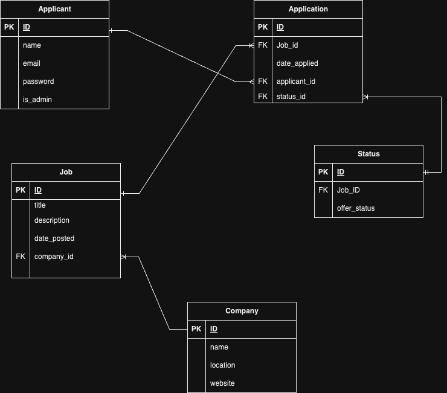

# Job Application Tracker

## T2A2 - API Webserver Project

## R1

The problem I am trying to solve by building a job application tracker is to streamline the job application process for applicants.
In particular, I am trying to help facilitate a more organised way for job seekers to manage their job applications.
Users of this app can add new applications, and record details such as the company name, position, and application status, as well as track interview dates and delete or update applications.

## R2

The problem of streamlining the job application process for job seekers is worth solving mainly due to efficieny and organisation.
Job seekers usually apply to multiple positions across various companies, through various methods and websites. Without having a centralised system to manage applications, it can become challenging to keep track of deadlines, details and statuses of each application.
By providing this application tracker, users can organise their applications and job searches more efficiently, therefore ensuring that no opportunities are missed or that they are not applying twice for the same job across different job-seeking websites.

## R3

For this project, I will be using PostgreSQL as the database system.
I have chosen this database system due to the comprehensive set of featues included, such as, support for stored procedures and various data types.
Furthermore, it is effective and manipulating and managing data which is important for data such as job applications that are constantly changing.

The major drawback to using PostgreSQL is the complexity involved. Due to PostgreSQL's extensive feature set, this can make the system more complex to manage and figure. Fortunately, as I am not expecting large amounts of data to occur, this should not be too much of an issue.

## R4

an ORM is a software technique that allows developers to map object-oriented models to relational databases, therefore, simplifying the interaction between the code and the database. Key functionalities and benefits of using an ORM include:

-   Language Consistency: Developers can write code in their preferred programming language instead of writing SQL statements.
-   Object-Relational Mapping: The ORM establishes a mapping between application objects and database tables, automatically translating operations into SQL statements.
-   Simplified CRUD Operations: An ORM provides high-level APIs and methods for Create, Read, Update, and Delete operations, reducing the complexeties of SQL commands.

## R5

### Application Controller

**Endpoint Documentation:**

#### Create Application Route

**HTTP Method:** POST

**Endpoint:** `/applications/`

**Data Required:**

-   `date_applied`: Date of the application (Format: "YYYY-MM-DD")
-   `status_id`: ID of the status for the application

**Authentication:** JWT token required.

**Expected Response Data (Success):**

-   Status Code: 201 (Created Successfully)
-   JSON Object which contains the created application data.

**Expected Response Data (Error):**

-   Status Code: 400 (Bad Request) or 404 (Not Found) or 401 (Unauthorised)
-   JSON Object with an error message.

---

#### Delete Application Route

**HTTP Method:** DELETE

**Endpoint:** `/applications/<int:application_id>`

**Authentication:** None required. Perhaps in future iteration I will make it so only an admin can delete an application.

**Expected Response Data (Success):**

-   Status Code: 200 (OK)
-   JSON Object with a success message.

**Expected Response Data (Error):**

-   Status Code: 404 (Not Found)
-   JSON Object with an error message.

---

#### Update Application Route

**HTTP Methods:** PUT, PATCH

**Endpoint:** `/applications/<int:application_id>`

**Data Required:**

-   `date_applied` (optional): Updated date of application (Format: "YYYY-MM-DD")

**Authentication:** JWT token required.

**Expected Response Data (Success):**

-   Status Code: 200 (OK)
-   JSON Object containing the updated application data.

**Expected Response Data (Error):**

-   Status Code: 404 (Not Found)
-   JSON Object with an error message.

---

### Auth Controller

**Endpoint Documentation:**

#### Register Applicant Route

**HTTP Method:** POST

**Endpoint:** `/auth/register`

**Data Required:**

-   `name`: Name of the applicant
-   `email`: Email of the applicant
-   `password`: Password of the applicant (Minimum length: 6 characters) required.

**Expected Response Data (Success):**

-   Status Code: 201 (Created)
-   JSON Object containing the registered applicant data.

**Expected Response Data (Error):**

-   Status Code: 401 (Unauthorised) or 400 (Bad Request)
-   JSON Object with an error message.

---

#### Login Applicant Route

**HTTP Method:** POST

**Endpoint:** `/auth/login`

**Data Required:**

-   `email`: Email of the applicant
-   `password`: Password of the applicant

**Expected Response Data (Success):**

-   Status Code: 200 (OK)
-   JSON Object containing the applicant's email, JWT token, and admin status.

**Expected Response Data (Error):**

-   Status Code: 401 (Unauthorised)
-   JSON Object with an error message.

---

### CLI Controller

**Endpoint Documentation:**

#### Create Database Tables Command

**Command:** `flask db create`

**Expected Output:**

-   A message indicating that the tables have been created.

---

#### Drop Database Tables Command

**Command:** `flask db drop`

**Expected Output:**

-   A message response indicating that the tables have been deleted.

---

#### Seed Database Tables Command

**Command:** `flask db seed`

**Expected Output:**

-   A message response indicating that the tables have been seeded with initial data.

---

### Job Controller

**Endpoint Documentation:**

#### Get All Jobs Route

**HTTP Method:** GET

**Endpoint:** `/jobs/`

**Expected Response Data (Success):**

-   Status Code: 200 (OK)
-   JSON Object containing a list of job data.

---

#### Get Single Job Route

**HTTP Method:** GET

**Endpoint:** `/jobs/<int:id>`

**Expected Response Data (Success):**

-   Status Code: 200 (OK)
-   JSON Object containing the job data.

**Expected Response Data (Error):**

-   Status Code: 404 (Not Found)
-   JSON Object with an error message.

---

#### Create Job Route

**HTTP Method:** POST

**Endpoint:** `/jobs/`

**Data Required:**

-   `title`: Title of the job
-   `description`: Description of the job

**Authentication:** JWT token required.

**Expected Response Data (Success):**

-   Status Code: 201 (Created)
-   JSON Object containing the created job data.

---

#### Delete Job Route

**HTTP Method:** DELETE

**Endpoint:** `/jobs/<int:id>`

**Authentication:** JWT token and admin status required.

**Expected Response Data (Success):**

-   Status Code: 200 (OK)
-   JSON Object with a success message.

**Expected Response Data (Error):**

-   Status Code: 404 (Not Found)
-   JSON Object with an error message.

---

#### Update Job Route

**HTTP Methods:** PUT, PATCH

**Endpoint:** `/jobs/<int:id>`

**Data Required:**

-   `title` (optional): Updated title of the job
-   `description` (optional): Updated description of the job

**Authentication:** JWT token required.

**Expected Response Data (Success):**

-   Status Code: 200 (OK)
-   JSON Object containing the updated job data.

**Expected Response Data (Error):**

-   Status Code: 404 (Not Found)
-   JSON Object with an error message.

## R6

